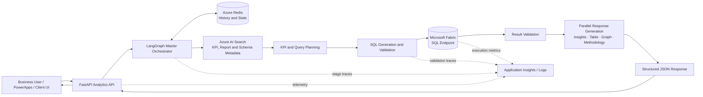
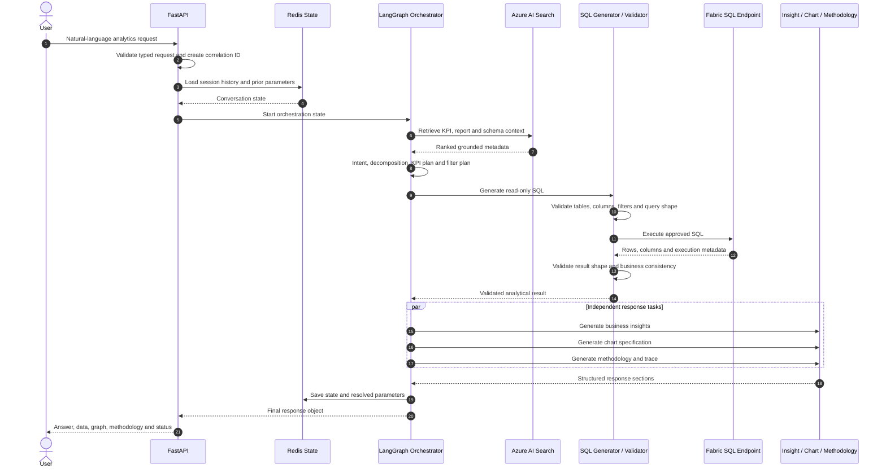
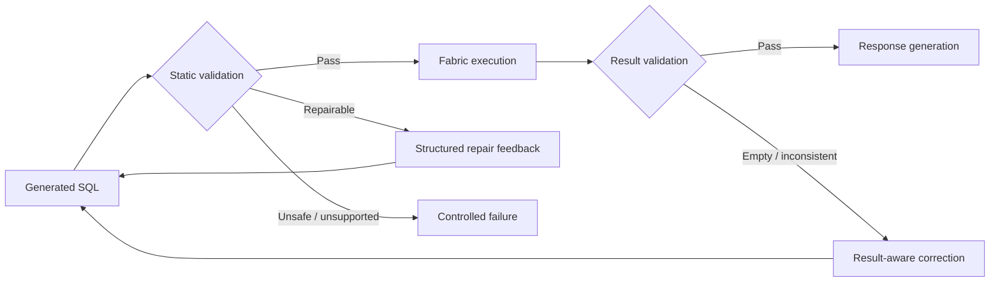
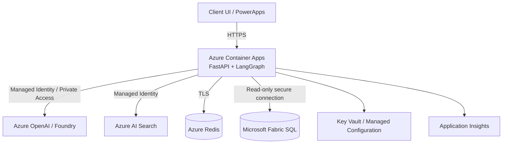

<p align="center">
  
</p>

<h1 align="center">Enterprise Agentic Analytics Platform</h1>

<p align="center">
  <strong>Natural-language analytics over Microsoft Fabric, orchestrated through specialized AI agents and delivered through a typed FastAPI backend.</strong>
</p>

<p align="center">
  Agentic Analytics · Microsoft Fabric · FastAPI · LangGraph · Azure AI Search · Redis
</p>

---

> **Public-safe case study:** This README describes a sanitized enterprise implementation. Client identifiers, internal resource names, proprietary KPI definitions, credentials, private endpoints, production prompts, and source datasets are intentionally excluded.

## Overview

The **Enterprise Agentic Analytics Platform** is a production-oriented analytics backend that converts a business user's natural-language question into a grounded, validated, and decision-ready analytical response.

It is not a generic chatbot and it does not allow an LLM to query enterprise data without controls. The platform combines:

- typed API contracts;
- state-based multi-agent orchestration;
- KPI and schema retrieval;
- query enrichment and decomposition;
- guarded SQL generation;
- Microsoft Fabric SQL execution;
- deterministic validation;
- conversational memory;
- charts, tables, methodology, and business insights.

A representative request such as:

> “Show Cloud & AI performance by region, compare it with the previous period, and explain the main driver.”

is converted into an execution plan, mapped to trusted KPI definitions, enriched with filters and table metadata, translated into validated SQL, executed against Microsoft Fabric, and returned as a structured analytical response.

---

## Hiring Signal

This project demonstrates:

- multi-agent system design;
- backend and API ownership;
- LangGraph orchestration;
- retrieval-grounded analytics;
- Microsoft Fabric integration;
- SQL generation and validation;
- stateful follow-up handling;
- caching and latency optimization;
- structured response design;
- secure Azure-native deployment.

---

## Table of Contents

1. [Problem Statement](#problem-statement)
2. [Objectives and Non-Goals](#objectives-and-non-goals)
3. [Impact Snapshot](#impact-snapshot)
4. [My Role](#my-role)
5. [Solution Overview](#solution-overview)
6. [High-Level Design](#high-level-design)
7. [Agentic Workflow](#agentic-workflow)
8. [Low-Level Design](#low-level-design)
9. [API and Data Contracts](#api-and-data-contracts)
10. [Validation and Reliability](#validation-and-reliability)
11. [Performance Engineering](#performance-engineering)
12. [Security and Governance](#security-and-governance)
13. [Observability](#observability)
14. [Error Handling](#error-handling)
15. [Technology Stack](#technology-stack)
16. [Representative Repository Structure](#representative-repository-structure)
17. [Testing Strategy](#testing-strategy)
18. [Deployment Model](#deployment-model)
19. [Engineering Decisions](#engineering-decisions)
20. [Example Workflow](#example-workflow)
21. [Challenges and Resolutions](#challenges-and-resolutions)
22. [Limitations](#limitations)
23. [Future Enhancements](#future-enhancements)
24. [Impact Statement](#impact-statement)

---

## Problem Statement

Enterprise business users often need answers that span multiple dashboards, reports, KPI dictionaries, dimensions, and time periods. Traditional business-intelligence workflows require users to:

- know which report contains the required KPI;
- understand the KPI definition and calculation logic;
- apply the correct filters and reporting hierarchy;
- select valid dimensions and comparison periods;
- interpret the result manually;
- create a chart or explanation for stakeholders.

A simple LLM interface does not solve this safely. An unconstrained model may select the wrong KPI, invent a field, generate invalid SQL, ignore a required filter, or produce a confident explanation that is not supported by the data.

The engineering problem was therefore to build a system that could:

1. understand the user's analytical intent;
2. ground the request in trusted KPI and schema metadata;
3. preserve conversational context across follow-ups;
4. create a controlled query plan;
5. generate SQL compatible with Microsoft Fabric;
6. validate the query before and after execution;
7. return explainable text, tables, charts, filters, and methodology;
8. remain responsive at enterprise scale.

---

## Objectives and Non-Goals

### Objectives

- Provide natural-language access to enterprise KPI data.
- Support complex questions, comparisons, breakdowns, and follow-ups.
- Ground every analytical request in curated KPI and table metadata.
- Execute read-only, validated queries against Microsoft Fabric.
- Return structured outputs suitable for UI rendering and downstream workflows.
- Preserve session history and update only changed parameters when possible.
- Keep orchestration modular, observable, testable, and reusable.
- Optimize latency through asynchronous and parallel execution.

### Non-Goals

- Replace the governed semantic and data-model layers.
- Allow unrestricted user-authored SQL.
- Let the LLM invent KPI definitions or schema fields.
- Treat retrieved context as automatically correct without validation.
- Expose client-specific metadata or production credentials publicly.
- Use a single large prompt as the entire architecture.

---

## Impact Snapshot

| Measure | Project Outcome |
|---|---:|
| Reports unified through the broader analytics context | **30+** |
| KPI coverage in the core domain | **140+** |
| KPI coverage across the broader orchestration context | **150+** |
| Measured analytical accuracy | **~95%** |
| End-to-end response latency | **Under 12 seconds** |
| Supported output modes | Text, tables, graphs, methodology, SQL trace, filters |
| Follow-up behavior | State-aware parameter updates without repeating the full pipeline |

> Metrics are presented at a public-safe level and exclude confidential business identifiers.

---

## My Role

I worked across the platform's agentic, backend, data-access, and reliability layers.

### Architecture and Orchestration

- Designed and implemented the custom-code multi-agent workflow.
- Built state-based orchestration using **LangGraph**.
- Defined clear responsibilities for intent, KPI planning, context enrichment, SQL, validation, insight, and chart generation.
- Supported query decomposition for questions containing multiple KPIs or analytical tasks.
- Added parallel execution where agent dependencies allowed it.

### Backend Engineering

- Built and extended the **FastAPI** analytics backend.
- Defined typed request and response contracts.
- Implemented asynchronous processing, routing, retries, status propagation, and structured error handling.
- Helped shape a response format that could power multiple UI tabs without additional backend calls.

### Retrieval and Data Integration

- Integrated **Azure AI Search** for KPI, report/program, schema, and table metadata.
- Connected the orchestration layer to the **Microsoft Fabric SQL endpoint**.
- Supported safe query generation, execution, validation, and repair patterns.
- Added Redis-backed history and metadata to support contextual follow-up questions.

### Reliability and Performance

- Improved latency through:
  - parallel agent execution;
  - Redis state reuse;
  - connection warm-up;
  - pooled Fabric SQL connections;
  - reduced repeated retrieval;
  - bounded structured responses.
- Added validation checkpoints before and after data execution.
- Contributed to logging, traceability, and failure isolation.

### Delivery and Collaboration

- Converted business requirements into reusable backend contracts.
- Supported technical walkthroughs, knowledge transfer, and architecture discussions.
- Helped maintain a publish-safe separation between client logic and reusable platform patterns.

---

## Solution Overview

The platform uses a **router plus multi-stage agentic pipeline**.

A master orchestration graph receives the request and coordinates specialized nodes. Retrieval is performed before query construction so that the model works with approved KPI definitions, tables, columns, filters, and relationships. SQL is validated before execution, and the result is validated again before insight generation.

The final API response is structured rather than free-form. It can include:

- direct answer;
- analytical insights;
- tabular data;
- graph specification;
- KPI and metric metadata;
- applied filters;
- generated SQL;
- methodology;
- confidence and validation state;
- warnings and error status.

---

## High-Level Design



### Architectural Boundaries

| Layer | Responsibility |
|---|---|
| Experience Layer | Accept the question and render structured results |
| API Layer | Authentication, validation, routing, request lifecycle |
| Orchestration Layer | State, agent sequencing, branching, retries |
| Knowledge Layer | KPI, report, table, filter, and schema metadata |
| Query Layer | Planning, SQL generation, SQL validation and repair |
| Data Layer | Governed Microsoft Fabric gold-layer data |
| Response Layer | Insight, table, chart, methodology and confidence |
| State Layer | Conversation history, prior parameters and warm metadata |
| Observability Layer | Correlation IDs, timings, failures and validation traces |

---

## Agentic Workflow

The public-safe implementation can be described as a **seven-stage analytical agent flow**.

| Stage | Logical Agent / Node | Responsibility |
|---:|---|---|
| 1 | Intent Understanding | Classify answer, comparison, chart, methodology, follow-up, or multi-KPI intent |
| 2 | Context and Memory | Retrieve prior question state and identify changed dimensions or filters |
| 3 | Query Decomposition | Break multi-part questions into executable analytical tasks |
| 4 | KPI Planning | Map each task to approved KPI definitions, measures, dimensions, and constraints |
| 5 | Metadata Enrichment | Retrieve report, table, column, relationship, and filter metadata |
| 6 | SQL and Execution | Generate, validate, repair if required, and execute Fabric-compatible SQL |
| 7 | Response Generation | Produce insights, graph instructions, table output, methodology, and confidence |

### Why Multiple Agents?

A single prompt would have to simultaneously interpret intent, remember history, choose KPIs, understand schema, generate SQL, validate the query, inspect the results, write insights, and recommend a chart.

Separating these responsibilities provides:

- smaller and more testable units;
- clearer failure ownership;
- independent prompts and tools;
- better observability;
- parallel execution opportunities;
- easier replacement of one model or component;
- lower risk of unsupported answers.

---

## Request Lifecycle



---

## Low-Level Design

### 1. API Layer

The FastAPI layer owns:

- endpoint routing;
- authentication and authorization hooks;
- request-schema validation;
- correlation ID generation;
- timeout and cancellation handling;
- orchestration invocation;
- response serialization;
- safe exception mapping.

Representative endpoint:

```text
POST /api/v1/analytics/query
```

The API remains thin. Analytical reasoning and data access are delegated to dedicated services and orchestration nodes.

### 2. Orchestration State

LangGraph maintains a typed state object across nodes.

Representative state:

```python
from typing import Any
from pydantic import BaseModel, Field


class AnalyticsState(BaseModel):
    correlation_id: str
    session_id: str
    user_query: str

    intent: str | None = None
    is_follow_up: bool = False
    previous_parameters: dict[str, Any] = Field(default_factory=dict)

    decomposed_queries: list[str] = Field(default_factory=list)
    selected_kpis: list[dict[str, Any]] = Field(default_factory=list)
    resolved_filters: dict[str, Any] = Field(default_factory=dict)

    retrieved_context: list[dict[str, Any]] = Field(default_factory=list)
    candidate_tables: list[str] = Field(default_factory=list)

    generated_sql: list[str] = Field(default_factory=list)
    validation_issues: list[str] = Field(default_factory=list)
    execution_results: list[dict[str, Any]] = Field(default_factory=list)

    insights: list[str] = Field(default_factory=list)
    graph_spec: dict[str, Any] | None = None
    methodology: str | None = None

    confidence: float | None = None
    warnings: list[str] = Field(default_factory=list)
    status: str = "running"
```

This state makes every stage inspectable and avoids passing unstructured prompt text between components.

### 3. Intent and Follow-Up Resolution

The intent node determines:

- new analytical request vs. follow-up;
- answer vs. trend vs. comparison vs. breakdown;
- whether the user requests a graph or methodology;
- whether the query contains multiple KPIs;
- which parameters changed from the prior request.

Example:

```text
Previous: "Show active usage for the current quarter."
Follow-up: "Now break it down by region."
```

The system reuses the previously resolved KPI and time period, modifies the grouping dimension, and avoids repeating the complete retrieval and planning path when safe.

### 4. KPI Planning

The KPI planning layer converts user language into a grounded metric plan.

Each plan can include:

```json
{
  "kpi_name": "Example KPI",
  "business_definition": "Approved enterprise definition",
  "measure": "approved_measure_name",
  "aggregation": "SUM",
  "dimensions": ["region"],
  "filters": {
    "period": "current_quarter"
  },
  "comparison": "previous_period",
  "source_document_ids": [
    "kpi-metadata-id"
  ]
}
```

The planner cannot create a KPI that is absent from the retrieved metadata. Unsupported matches are returned as clarification or no-match states.

### 5. Metadata Retrieval

Azure AI Search provides controlled retrieval over curated metadata, including:

- KPI definitions;
- supported dimensions;
- business terminology and aliases;
- report/program metadata;
- table and column descriptions;
- approved filters and values;
- relationships and join hints;
- methodology descriptions.

Typical retrieval stages:

1. normalize the query;
2. perform semantic/vector retrieval;
3. apply metadata filters;
4. re-rank candidates;
5. retain only the context required by the next node;
6. attach source IDs for traceability.

### 6. Query Enrichment

The enrichment layer combines:

- user intent;
- resolved KPI plan;
- conversation context;
- retrieved schema;
- filter aliases;
- dimension requirements;
- time-period rules;
- comparison logic.

It produces a constrained query instruction rather than sending the entire conversation to the SQL generator.

### 7. SQL Generation

The SQL generator receives only approved context and produces read-only Fabric-compatible SQL.

Controls include:

- allow-listed tables and columns;
- approved aggregations;
- filter-value normalization;
- bounded date logic;
- explicit grouping and ordering;
- row limits where applicable;
- no DDL or DML;
- no unrestricted cross-schema exploration.

### 8. SQL Validation and Repair

Validation occurs before execution.

Checks include:

- statement is read-only;
- referenced tables exist;
- referenced columns exist;
- joins follow known relationships;
- filters use supported values;
- aggregation and grouping are consistent;
- date and comparison logic is valid;
- query is within configured complexity limits.

When the query fails a repairable check, the validator returns structured feedback to the generator for a bounded retry.



### 9. Fabric Execution Layer

The data-access layer manages:

- secure authentication;
- connection creation and warm-up;
- pooled connections;
- query timeouts;
- cancellation;
- retryable connection errors;
- result normalization;
- type conversion;
- execution metrics.

Only the execution service communicates directly with the Fabric SQL endpoint.

### 10. Result Validation

Post-execution checks inspect:

- empty result sets;
- unexpected nulls;
- duplicate group keys;
- incorrect column shape;
- non-numeric values for numeric KPIs;
- result size;
- comparison-period completeness;
- total vs. breakdown consistency where applicable.

A technically successful SQL query is not treated as a valid analytical result until these checks pass.

### 11. Parallel Response Generation

Once the validated data is available, independent response tasks can run concurrently:

- insight generation;
- chart recommendation/specification;
- methodology explanation;
- response summary;
- confidence calculation.

This reduces latency compared with running each response stage sequentially.

### 12. Redis State Layer

Redis stores public-safe equivalents of:

- conversation history;
- previously resolved KPI and filters;
- session metadata;
- retrieval references;
- warm connection metadata;
- short-lived cached context.

The state layer enables contextual follow-ups while preventing the model from rebuilding the entire analytical plan unnecessarily.

---

## API and Data Contracts

### Request Contract

```python
from pydantic import BaseModel, Field


class AnalyticsRequest(BaseModel):
    question: str = Field(min_length=3, max_length=4000)
    session_id: str
    user_id: str | None = None
    response_modes: list[str] = ["answer", "table", "insight"]
    include_sql: bool = False
    include_methodology: bool = True
```

Example:

```json
{
  "question": "Show Cloud & AI performance by region and compare it with the previous period.",
  "session_id": "session-7f31",
  "response_modes": [
    "answer",
    "table",
    "graph",
    "insight"
  ],
  "include_sql": false,
  "include_methodology": true
}
```

### Response Contract

```python
class AnalyticsResponse(BaseModel):
    request_id: str
    status: str
    answer: str | None
    insights: list[str]
    table: list[dict]
    graph: dict | None

    kpis: list[dict]
    applied_filters: dict
    methodology: str | None

    confidence: float | None
    warnings: list[str]
    errors: list[dict]
    latency_ms: int
```

Example:

```json
{
  "request_id": "req-b90b",
  "status": "success",
  "answer": "The selected region leads the comparison period on the resolved KPI.",
  "insights": [
    "Performance increased in three of the four reported regions.",
    "The leading region contributed the largest share of the overall change."
  ],
  "table": [
    {
      "region": "Region A",
      "current_value": 124.5,
      "previous_value": 113.2,
      "change_percent": 9.98
    }
  ],
  "graph": {
    "type": "grouped_bar",
    "category": "region",
    "series": [
      "current_value",
      "previous_value"
    ]
  },
  "kpis": [
    {
      "name": "Resolved KPI",
      "source": "curated KPI metadata"
    }
  ],
  "applied_filters": {
    "period": "current_period",
    "comparison": "previous_period"
  },
  "methodology": "The KPI was resolved from curated metadata and queried from the governed Fabric data layer.",
  "confidence": 0.94,
  "warnings": [],
  "errors": [],
  "latency_ms": 8420
}
```

---

## Validation and Reliability

Reliability is implemented as a sequence of contracts, not as a final prompt instruction.

### Grounding Contract

- The KPI must resolve to curated metadata.
- The selected dimensions and filters must be supported.
- Source metadata IDs are retained for traceability.
- An unresolved KPI triggers clarification instead of invention.

### Query Contract

- SQL is read-only.
- Tables, columns, joins, and filters are validated.
- Query complexity is bounded.
- Repair attempts are limited.
- Failed queries return controlled diagnostic states.

### Result Contract

- The shape must match the analytical plan.
- Comparison requests must contain both periods.
- Breakdown results must contain the requested dimension.
- Empty results are explained rather than converted into fabricated insights.

### Response Contract

- Insights must be supported by returned values.
- Chart specifications must use actual columns.
- Methodology must reflect applied KPI and filters.
- Confidence is reduced when retrieval or validation is ambiguous.

---

## Performance Engineering

The platform was designed for low-latency enterprise use rather than offline batch generation.

### Optimizations

- **Asynchronous API execution:** Non-blocking orchestration and external calls.
- **Parallel nodes:** Independent KPI, insight, graph, and methodology tasks can run concurrently.
- **Redis-backed state reuse:** Follow-ups modify resolved parameters rather than rerunning every stage.
- **Connection pooling:** Reuses Fabric SQL connections.
- **Connection warm-up:** Avoids cold connection setup in the critical request path.
- **Bounded retrieval:** Sends only relevant KPI and schema context downstream.
- **Structured agent outputs:** Reduces parsing retries and oversized responses.
- **Failure isolation:** One optional output mode can fail without discarding a valid core answer.
- **Conditional routing:** Skips graph or methodology nodes when they were not requested.

These patterns supported an end-to-end response target of **under 12 seconds** in the measured project context.

---

## Security and Governance

### Identity

- Microsoft Entra ID-based access patterns.
- Managed Identity or workload identity for service-to-service authentication.
- No credentials embedded in source code.
- Environment-specific secrets stored in approved secret/configuration services.

### Network

- Private endpoint patterns for Azure services where required.
- Restricted inbound and outbound access.
- No direct public access to Fabric data endpoints from the browser.

### Data Controls

- Read-only analytics access.
- Least-privilege database permissions.
- Allow-listed metadata and schema boundaries.
- No user-provided SQL execution.
- Sensitive values excluded from logs and model prompts where possible.

### LLM Controls

- Curated context before generation.
- Structured schemas for agent outputs.
- Prompt-injection-resistant separation between user text and system metadata.
- No tool execution based solely on unvalidated model output.
- Bounded retries and explicit unsupported states.

---

## Observability

Each request is assigned a correlation ID and traced across the execution graph.

Recommended telemetry fields:

| Category | Examples |
|---|---|
| Request | request ID, session ID, endpoint, response modes |
| Orchestration | node name, start/end time, branch selected |
| Retrieval | index, query, top-k, selected document IDs |
| Planning | resolved KPI, dimensions, filters, comparison |
| SQL | attempt number, validation result, execution duration |
| Fabric | connection state, row count, timeout/error class |
| Response | generated sections, confidence, warnings |
| Performance | total latency and stage-level latency |
| Failure | safe exception category and recoverability |

Production logs should never contain secrets, access tokens, confidential row-level data, or unrestricted prompt payloads.

---

## Error Handling

| Failure | Platform Behavior |
|---|---|
| KPI cannot be resolved | Ask a targeted clarification or return supported alternatives |
| Search returns weak metadata | Lower confidence and stop before SQL generation |
| Unsupported filter value | Normalize through approved aliases or return a clear validation error |
| Unknown table or column | Block execution and send structured repair feedback |
| Unsafe SQL | Reject without execution |
| Fabric connection issue | Retry only when classified as transient |
| SQL timeout | Cancel, log, and return a controlled timeout state |
| Empty result | Explain that no matching data was found; do not fabricate insight |
| Chart generation failure | Return valid answer/table with graph warning |
| Optional methodology failure | Preserve core analytical response |
| Session state unavailable | Continue as a new request with a warning |
| Partial multi-KPI failure | Return successful KPI sections and identify failed sections |

---

## Technology Stack

| Area | Technology |
|---|---|
| Language | Python |
| API | FastAPI |
| Orchestration | LangGraph |
| LLM / Agent Reasoning | Azure OpenAI, Azure AI Foundry |
| Retrieval | Azure AI Search |
| Analytical Data | Microsoft Fabric SQL endpoint |
| State and Cache | Azure Redis |
| Validation | Pydantic, deterministic Python checks |
| Concurrency | AsyncIO and parallel graph execution |
| Containerization | Docker |
| Hosting | Azure Container Apps |
| Identity | Microsoft Entra ID, Managed Identity |
| Networking | Azure Private Endpoint patterns |
| Monitoring | Application Insights / Azure Monitor |
| Query Language | SQL |

---

## Representative Repository Structure

The following structure is a sanitized representation of the platform boundaries, not a disclosure of the internal repository.

```text
enterprise-agentic-analytics-platform/
├── app/
│   ├── main.py
│   ├── api/
│   │   ├── routes.py
│   │   ├── dependencies.py
│   │   └── error_handlers.py
│   ├── contracts/
│   │   ├── requests.py
│   │   ├── responses.py
│   │   └── state.py
│   ├── orchestration/
│   │   ├── graph.py
│   │   ├── router.py
│   │   └── transitions.py
│   ├── agents/
│   │   ├── intent.py
│   │   ├── context.py
│   │   ├── decomposition.py
│   │   ├── kpi_planner.py
│   │   ├── query_enricher.py
│   │   ├── sql_agent.py
│   │   ├── validation.py
│   │   ├── insight.py
│   │   ├── graph_agent.py
│   │   └── methodology.py
│   ├── retrieval/
│   │   ├── kpi_search.py
│   │   ├── schema_search.py
│   │   └── metadata_filters.py
│   ├── data/
│   │   ├── fabric_client.py
│   │   ├── connection_pool.py
│   │   └── result_normalizer.py
│   ├── memory/
│   │   └── redis_state.py
│   ├── validation/
│   │   ├── sql_validator.py
│   │   ├── filter_validator.py
│   │   └── result_validator.py
│   └── observability/
│       ├── logging.py
│       ├── metrics.py
│       └── tracing.py
├── tests/
│   ├── unit/
│   ├── integration/
│   ├── contract/
│   └── golden_queries/
├── Dockerfile
├── pyproject.toml
├── .env.example
└── README.md
```

---

## Testing Strategy

### Unit Tests

- intent classification;
- follow-up parameter merging;
- KPI-plan parsing;
- filter alias normalization;
- SQL safety rules;
- table and column validation;
- result-shape validation;
- chart-column compatibility;
- response serialization.

### Contract Tests

- request and response schema stability;
- error payloads;
- optional output modes;
- null and empty result handling;
- backward compatibility.

### Retrieval Tests

- known query-to-KPI matches;
- ambiguous KPI handling;
- unsupported KPI handling;
- metadata-filter correctness;
- source ID retention.

### SQL Tests

- approved query patterns;
- invalid joins;
- missing columns;
- unsupported filters;
- date comparisons;
- grouping and aggregation rules;
- malicious or non-read-only statements.

### Integration Tests

- Azure AI Search retrieval;
- Redis history round trip;
- Fabric SQL execution;
- managed identity authentication;
- timeout and retry behavior.

### Golden Analytical Tests

A curated suite of representative business questions validates:

- resolved KPI;
- applied filters;
- generated SQL shape;
- returned values;
- insight consistency;
- chart recommendation;
- methodology;
- confidence.

### Resilience Tests

- search unavailability;
- Redis unavailability;
- transient Fabric connection errors;
- model timeout;
- partial multi-KPI failure;
- malformed structured model output.

---

## Deployment Model



### Deployment Characteristics

- Dockerized FastAPI service.
- Azure Container Apps hosting.
- Environment-specific configuration.
- Managed identity-based service access.
- Health and readiness endpoints.
- Horizontal scaling subject to connection and model limits.
- Centralized logging and telemetry.
- Production secrets kept outside the image and repository.

---

## Engineering Decisions

### 1. Multi-Agent Graph Instead of One Prompt

**Decision:** Decompose the workflow into specialized stateful nodes.

**Reason:** Analytical requests combine intent, retrieval, planning, SQL, validation, and presentation. Separating them improves control, testability, and failure isolation.

### 2. Metadata-First Query Generation

**Decision:** Retrieve KPI and schema metadata before generating SQL.

**Reason:** The model should reason from approved enterprise definitions rather than infer table and measure names from general language.

### 3. Deterministic Validation Around LLM Reasoning

**Decision:** Use LLMs for interpretation and generation, while Python services enforce safety and structural rules.

**Reason:** Prompt instructions alone are not sufficient for reliable SQL or business-rule compliance.

### 4. Stateful Follow-Ups

**Decision:** Store resolved parameters and conversation state in Redis.

**Reason:** Follow-up questions usually modify one dimension, filter, or period. Reusing the previous plan improves latency and consistency.

### 5. Structured Response Instead of Plain Text

**Decision:** Return a typed multi-section response.

**Reason:** The same backend response can power answer, graph, table, methodology, audit, and debug views.

### 6. Parallel Output Generation

**Decision:** Generate independent response sections concurrently.

**Reason:** Insight, chart, and methodology generation depend on the same validated data and do not need to block one another.

### 7. Controlled Partial Success

**Decision:** Preserve valid outputs when optional stages fail.

**Reason:** A chart failure should not discard a valid analytical answer and table.

---

## Example Workflow

### User Question

```text
Show Cloud & AI performance by region, compare it with the previous period,
and explain which region contributed most to the change.
```

### Resolved Plan

```json
{
  "intent": "comparison_with_breakdown",
  "kpi": "resolved_from_curated_metadata",
  "dimensions": [
    "region"
  ],
  "period": "current_period",
  "comparison_period": "previous_period",
  "outputs": [
    "answer",
    "table",
    "graph",
    "insight",
    "methodology"
  ]
}
```

### Execution

1. Resolve the question as a comparison and regional breakdown.
2. Retrieve the approved KPI definition.
3. Retrieve supported region, period, table, and column metadata.
4. Build the constrained query instruction.
5. Generate and validate read-only SQL.
6. Execute against Microsoft Fabric.
7. Verify current and prior period completeness.
8. Calculate contribution and change fields from returned data.
9. Generate the answer, insights, chart specification, and methodology.
10. Store resolved state for the next follow-up.

### Possible Follow-Up

```text
Now show only the top three regions and use percentage contribution.
```

The platform reuses the resolved KPI and comparison period, updates the ranking and output calculation, and avoids repeating the complete KPI discovery flow.

---

## Challenges and Resolutions

### Ambiguous Business Language

**Challenge:** The same KPI can be referenced through acronyms, informal labels, report names, or business terminology.

**Resolution:** Curated aliases and semantic retrieval are combined with an explicit KPI resolution step. Weak matches are clarified rather than silently accepted.

### Follow-Up Questions

**Challenge:** A follow-up may omit the KPI and mention only a changed dimension.

**Resolution:** Redis-backed state preserves the previous analytical plan and merges only validated parameter changes.

### SQL Hallucination

**Challenge:** An LLM can generate syntactically plausible SQL with invalid tables, joins, or filters.

**Resolution:** Metadata-first generation, allow-listed schema context, static validation, bounded repair, and post-execution checks.

### Latency Across Multiple Agents

**Challenge:** Sequential agents and repeated external calls increase response time.

**Resolution:** Conditional routing, asynchronous calls, parallel independent nodes, connection pooling, warm-up, and context reuse.

### Partial Failures

**Challenge:** Graph or methodology generation can fail after successful data execution.

**Resolution:** Structured response sections support partial success and return explicit warnings without losing valid outputs.

### Enterprise Security

**Challenge:** Data and model services cannot be exposed directly to the browser.

**Resolution:** All calls are mediated by the backend using managed identity, least privilege, and private-access patterns.

---

## Limitations

- Answer quality depends on the quality and freshness of KPI and schema metadata.
- Highly ambiguous questions may require user clarification.
- New KPIs and schema changes require metadata refresh and regression testing.
- Complex cross-domain questions may need decomposition into several bounded queries.
- Generated insights are constrained by the returned analytical result and should not be interpreted as causal proof.
- The public repository does not expose confidential datasets, prompts, resource names, or production source code.

---

## Future Enhancements

- Add an MCP-compatible analytics tool interface.
- Introduce automated KPI and schema change detection.
- Add continuous LLM and retrieval evaluation dashboards.
- Support streaming orchestration events to the UI.
- Add policy-as-code for SQL and filter validation.
- Expand chart specifications into a standard visualization grammar.
- Add stronger data-lineage and source-reference output.
- Introduce human approval for selected high-impact analytical workflows.
- Add model fallback and adaptive routing by task complexity.
- Extend conversation memory with explicit user-confirmed analytical context.

---

## Impact Statement

The Enterprise Agentic Analytics Platform transformed a fragmented dashboard-navigation workflow into a governed natural-language analytics experience.

It enabled business users to move from a question to a validated answer, table, graph, and methodology without manually locating the correct report, KPI definition, schema, or filter combination. The system demonstrated that enterprise GenAI becomes reliable when model reasoning is bounded by typed contracts, curated metadata, deterministic validation, secure data access, and observable orchestration.

In the measured project context, the architecture:

- unified insights across **30+ reports**;
- supported **140+ domain KPIs** and a broader context of **150+ KPIs**;
- achieved approximately **95% analytical accuracy**;
- returned responses in **under 12 seconds**;
- supported contextual follow-ups through Redis-backed state;
- produced reusable structured outputs for text, tables, charts, and methodology.

---

## Portfolio Summary

> Built a FastAPI and LangGraph-based multi-agent analytics platform that converts natural-language business questions into KPI retrieval, query enrichment, validated SQL execution over Microsoft Fabric, and structured insights, tables, graphs, and methodology. Integrated Azure AI Search for KPI and schema grounding, Redis for conversational state, and Azure Container Apps for cloud-native deployment.

---

## Contact

**Satnam Singh**  
Agentic GenAI Developer · Python Backend Developer · Microsoft Fabric and Azure AI Engineer

- Portfolio: `satnamsingh.in`
- LinkedIn: `linkedin.com/in/22satnam`
- GitHub: `github.com/22satnam`
- Email: `satnamsjob@gmail.com`

---

<p align="center">
  <strong>Ask. Plan. Validate. Insight.</strong>
</p>
